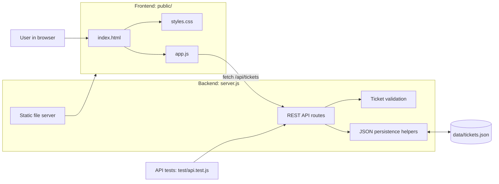
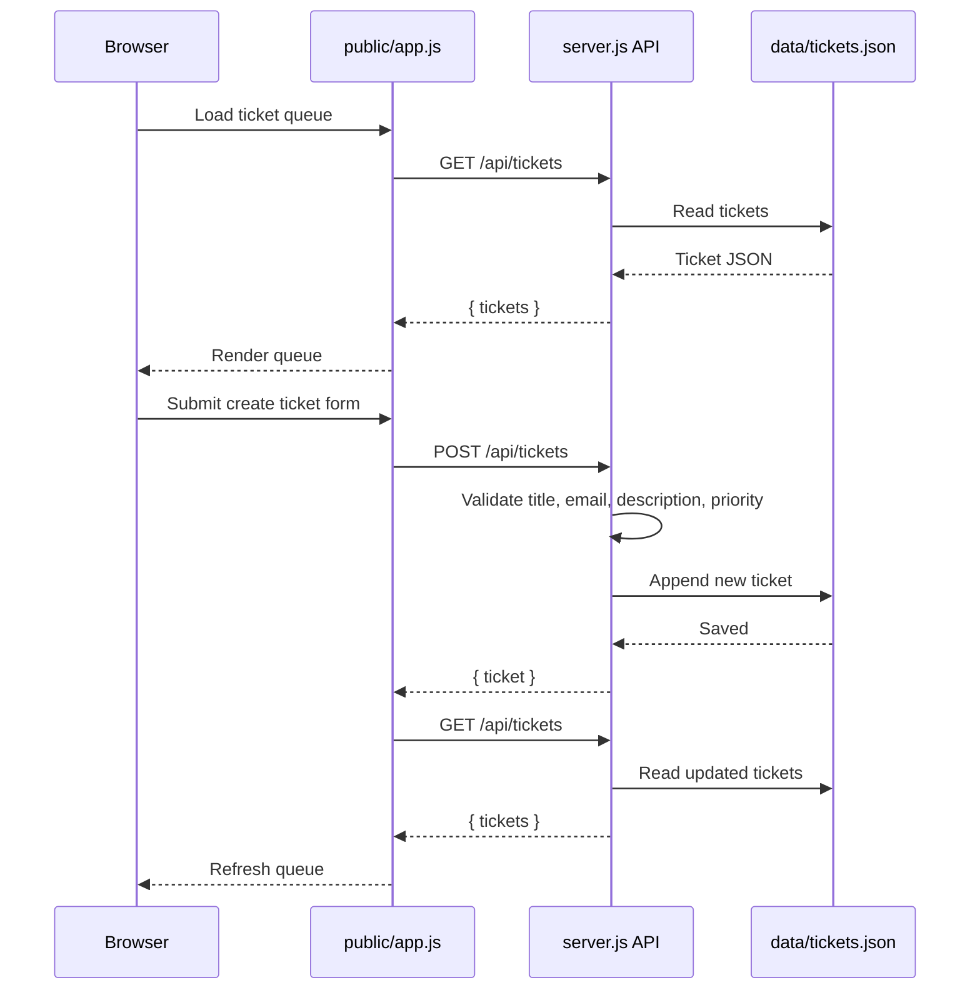

# System Architecture

This app is a small full-stack support ticket system. The backend and frontend are split by responsibility, but they live in one simple Node project.

## Component Diagram

## Request Flow

## Responsibilities

- `server.js`: runs the HTTP server, serves static files, handles API routes, validates ticket input, and reads/writes ticket data.
- `public/index.html`: defines the page structure and ticket template.
- `public/app.js`: manages browser-side state, form submission, filtering, status updates, and rendering.
- `public/styles.css`: styles the responsive support desk interface.
- `data/tickets.json`: stores the current ticket records.
- `test/api.test.js`: verifies core API behavior with an isolated temporary data file.

## API Surface

- `GET /api/tickets`: list tickets, optionally filtered by `status` or search query `q`.
- `POST /api/tickets`: create a new ticket.
- `GET /api/tickets/:id`: fetch one ticket.
- `PATCH /api/tickets/:id`: update a ticket status.
